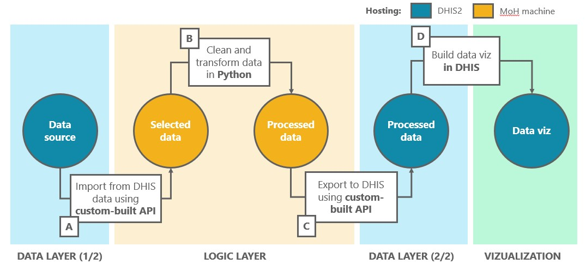

# Continuity of Essential Health Services App 

 

 

## Resources

 

- **User documentation**, providing a general overview of the project and intended for a non-technical audience *[Add link]*
- **Video demos**, covering a general introduction to the user interface of the app, a technical overview, and a walk-through of how to add indicators *[Add links]*
- **Technical documentation**, including this readme file as well as in-code documentation, providing more detailed insights for data practitioners, as well as specific documentation developed for the API *[Add links]*
- **Backlog documentation**, a prioritized list of additional requests gathered through product development, to be addressed in priority in further development of the tool *[Add links]*

 

## Context

 

**This project was developed under the Intelligence Community Health Systems initiative** (iCoHS), a partnership between the **Rockefeller** Foundation and **UNICEF** which aims to support the Government of **Uganda Ministry of Health** (MoH) to use data to strengthen community health systems.  The tool was developed by **Dalberg Data Insights**.

**This tool provides access to clean, time-consistent data on continuity of health services** before, during, and after the COVID-19 crisis. It addresses three key challenges faced by the MoH.

**For more information**, consult the user documentation *[Add links]*

 

## Technical overview

 

**The tool extracts, cleans, transforms data** from DHIS2 using open-source technology

**The data layer** leverages a custom built API, with more detailed information available here *[Add links]* 

**The logic layer** leverages is structured as a Postgres SQL database, interacting with csv and json files in the repository 

 

## Repository structure

 

| File/folder | Description |
|-------------|-------|
|**./data/input**|Where the data to be processed by the pipeline is stored after import by the API |
|**./data/cleaned**||
|**./data/output**||
|**./app.py**||
|**./src/api**||
|**./src/db**||
|**./src/pipeline/clean.py**||
|**./src/pipeline/process.py**||
|||
|||
|||
|||

## Workflow

 

### Basic functionalities

 

#### Set-up

#### Full run

#### Standard run

### Adding indicators

 

#### Updating config

#### Running the pipeline